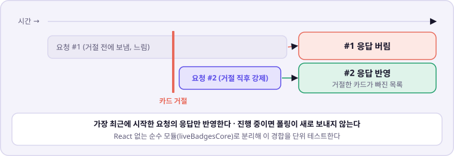
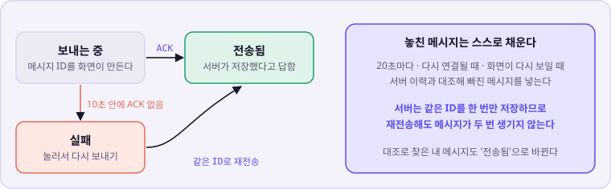
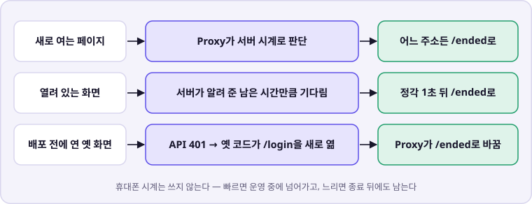
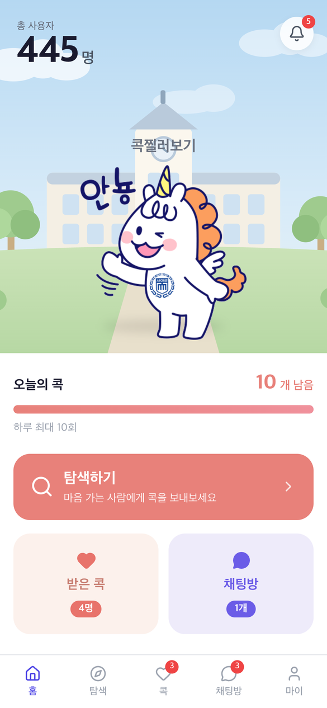
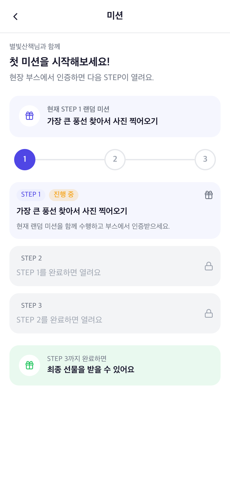
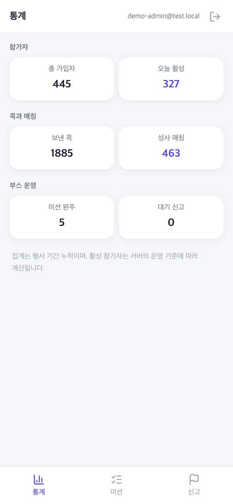

# facecook-fe

콕찔러보기의 프론트엔드다. 참가자와 운영진이 쓰는 화면을 Next.js 하나로 만들고, 홈 화면에 추가하면 앱처럼 쓰는 PWA로 낸다.

2026.09.30 ~ 10.02 축제 3일 동안 실제로 운영했다. 서비스 소개와 전체 흐름은 [조직 README](https://github.com/seoil-power-rangers)에 있다.

---

## 필요한 문서 찾기

| 하려는 일 | 문서 |
| --- | --- |
| Issue, 브랜치, 커밋과 PR 규칙 확인 | [공통 협업 가이드](./CONTRIBUTING.md) |
| 에이전트·구현 규칙 확인 | [AGENTS.md](./AGENTS.md) |
| 기능 범위와 정책 확인 | [기능 명세](./docs/기능명세.md) |
| API 요청·응답 확인(원본은 facecook-be) | [API 명세](./docs/API명세.md) |
| 배포와 CI 확인 | [CI/CD](./docs/CICD.md) |
| 화면 폴더별 설명 확인 | [ui 안내](./ui/README.md) |

---

## 쉽게 말하면

폴링으로 배지를 맞추고, 채팅 메시지를 잃지 않고, 행사가 끝나는 순간 모든 화면을 닫는다. 아래 그림 세 장이 핵심이다.

### 늦게 온 응답이 최신 화면을 덮지 않는다

<picture>
  <source media="(prefers-color-scheme: dark)" srcset="docs/img/latest-only-dark.svg">
  
</picture>

콕·매칭 배지는 10초마다 서버에 묻는다. 거절 직후 오래된 응답이 도착해 지운 카드가 되살아나던 문제를 순번 규칙으로 막았다. 탭을 옮겨도 폴링을 멈췄다 다시 시작하지 않고 이어 쓴다.

### 메시지는 서버가 받았다고 해야 "전송됨"이다

<picture>
  <source media="(prefers-color-scheme: dark)" srcset="docs/img/chat-ack-dark.svg">
  
</picture>

휴대폰 네트워크는 자주 끊긴다. 화면이 만든 메시지 ID를 끝까지 유지해서, 다시 보내도 서버에 두 번 쌓이지 않는다. 실시간으로 못 받은 메시지는 화면이 스스로 서버 이력과 대조해 채운다.

### 종료 시각에 모든 화면이 닫힌다

<picture>
  <source media="(prefers-color-scheme: dark)" srcset="docs/img/service-end-dark.svg">
  
</picture>

홈 화면에 추가한 앱은 며칠씩 새로고침 없이 열려 있다. 그래서 새 코드를 받은 화면과 받지 못한 옛 화면을 따로 다뤘다. 옛 화면은 원래 하던 "401이면 로그인 화면으로"를 이용해 종료 화면까지 데려간다. 이 경로는 옛 빌드로 직접 재현해 확인했다.

---

## 화면

| 홈 | 미션 | 운영진 통계 |
| :---: | :---: | :---: |
|  |  |  |
| 오늘 남은 콕과<br>새 소식을 한눈에 | 부스에서 확인받으면<br>다음 단계가 열려요 | 운영진은 현황·신고·<br>미션 완료를 처리해요 |

<sub>화면은 로컬에 실제 운영과 같은 규모(참가자 445명·콕 1,885건·매칭 463건)의 가상 참가자를 넣어 찍었다.</sub>

---

## 저장소 구조

```text
facecook-fe/
├── src/app/      라우팅만. page.tsx는 ui/ 화면에 파라미터를 넘기는 얇은 래퍼
├── src/proxy.ts  종료 시각 이후 모든 화면 요청을 /ended로
├── ui/           실제 화면. 화면 폴더마다 *Api.ts에 API 호출을 모은다
│   ├── 공통/      세션, API 뼈대, 배지 폴링, 분석, PWA, 종료 감시
│   ├── 로그인/ 프로필작성/ 탐색/ 받은콕/ 매칭/ 채팅/ 미션/ 마이페이지/
│   ├── 관리자/ 신고/ 알림/
│   └── 종료/      종료 화면과 익명 후기
└── public/       아이콘, 서비스워커(push-sw.js), 오프라인 화면
```

백엔드 로직은 두지 않는다. 데이터는 facecook-be의 REST API와 STOMP로만 주고받는다.

---

## 로컬에서 실행하기

Node 20 이상이 필요하다. 백엔드를 먼저 띄운다([facecook-be](https://github.com/seoil-power-rangers/facecook-be#로컬에서-실행하기)).

```bash
npm install
cp .env.example .env.local
npm run dev
```

http://localhost:3000 — `/`로 들어오면 로그인 화면으로 간다.

### 환경 변수

| 변수 | 쓰임 |
| --- | --- |
| `NEXT_PUBLIC_API_BASE_URL` | 백엔드 주소. WebSocket 주소도 여기서 만든다 |
| `NEXT_PUBLIC_CHAT_OPEN_HOUR` · `NEXT_PUBLIC_CHAT_CLOSE_HOUR` | 채팅 입력창을 여는 시간(백엔드 운영 시간과 맞춘다) |
| `NEXT_PUBLIC_POSTHOG_KEY` · `_HOST` | 사용 분석. 비우면 아무것도 보내지 않는다 |
| `NEXT_PUBLIC_POSTHOG_REPLAY` | 화면 녹화. 동의받은 테스트 기간에만 켰고, 축제 기간에는 껐다 |
| `SERVICE_END_AT` | 서비스 종료 시각. 서버 변수라 Proxy만 읽는다 |

`NEXT_PUBLIC_*`는 빌드할 때 화면 코드에 박힌다. Vercel에서 값을 바꾸면 다시 배포해야 반영된다. 비밀값을 넣지 않는다.

### 변경 사항 검증

```bash
npx next typegen
npx tsc --noEmit
npm test
npm run build
```

`npm test`는 `ui/**/*.test.ts`를 모아 `node:test`로 돌린다. 테스트할 로직은 React·Next·`@ui` 별칭 없이 쓰는 순수 모듈로 분리한다(예: `liveBadgesCore.ts`, `serviceEnd.ts`).

---

## 배포

- Vercel이 Preview와 Production 배포를 맡는다. `main`에 병합하면 자동으로 배포된다.
- GitHub Actions는 PR마다 타입 생성, 타입 검사, 단위 테스트를 돌린다.
- 사용 분석은 자동 수집(모든 클릭·입력)을 끄고 정해 둔 이벤트만 보낸다. 소개팅 서비스라 입력 내용이 수집되지 않게 하기 위해서다.

---

## 알려진 한계

| | 왜 |
| --- | --- |
| 새로고침 직후 콕·매칭 조회 1~2건 중복 | 첫 화면이 진행 중인 폴링 요청을 함께 쓰지 못한다 |
| 린트를 CI에 넣지 않았다 | 기존 react-hooks 규칙 오류 4건이 남아 있다 |

---

<sub>작업 방식은 [CONTRIBUTING.md](./CONTRIBUTING.md)를 따른다. 서버 로직은 [facecook-be](https://github.com/seoil-power-rangers/facecook-be)의 책임이다.</sub>
