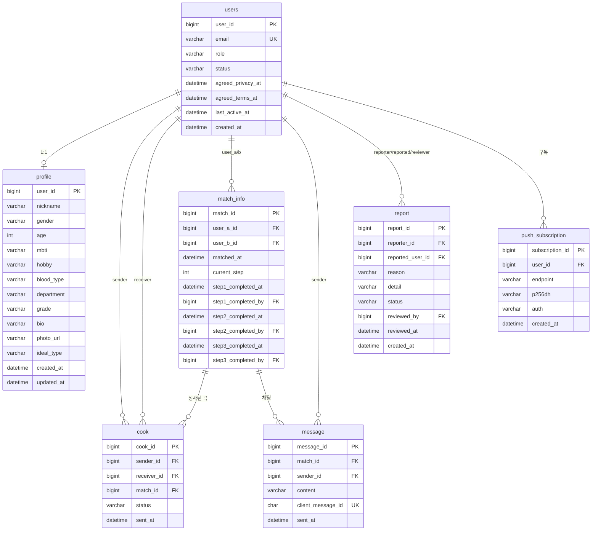

# face 콕 — ERD (MySQL)

정리 기준일: 2026-09-03

## 1. 설계 결정 사항

기존 Supabase(PostgreSQL) 스키마를 MySQL 기준으로 재정리하면서 바뀐 부분이다.

| 항목 | 기존 | 이번 결정 | 이유 |
| --- | --- | --- | --- |
| `user_id` 타입 | UUID | **BIGINT AUTO_INCREMENT** | Supabase Auth 연동 전제로 UUID였는데, 이제 Auth 자체를 안 씀. Spring+JPA 기본 패턴과도 더 자연스러움 |
| 미션 진행상황 | (검토) 별도 테이블 vs 합침 | **`match_info`에 합침** | STEP 1~3 고정이라 확장성보다 단순함 우선, 기존 검증된 방식 재사용 |
| `report.reason` | "카테고리\n상세"로 한 컬럼에 합쳐 저장 | **`reason`/`detail` 컬럼 분리** | 새로 짜는 거라 굳이 문자열 합치기 안 해도 됨 |
| 메시지 멱등성 | 없음 | **`message.client_message_id` 추가** | ACK 미수신 시 재전송해도 중복 저장 안 되게 |
| 웹 푸시 | 없음 | **`push_subscription` 테이블 신설** | |

**추가 확인 필요한 것 (팀 논의 필요):** 관리자 계정을 `users` 테이블에 실제 row로 둘지. 예전 Supabase 코드는 관리자가 `.env` 공유 계정이라 `users`에 없었고, 그래서 `match_info.step1_completed_by`, `report.reviewed_by`가 항상 NULL이었다. 이번엔 관리자도 `users`에 `role='admin'`으로 실제 row를 두면, **누가 승인/처리했는지 제대로 기록**할 수 있다. 이렇게 가는 걸 추천하지만 로그인 설계 담당과 합의 필요.

## 2. ER 다이어그램



## 3. 테이블 상세

### users
| 컬럼 | 타입 | 제약 | 설명 |
| --- | --- | --- | --- |
| user_id | BIGINT | PK, AUTO_INCREMENT | |
| email | VARCHAR(255) | NOT NULL, UNIQUE | |
| role | VARCHAR(20) | NOT NULL, DEFAULT 'participant' | participant / admin |
| status | VARCHAR(20) | NOT NULL, DEFAULT 'active' | active / suspended |
| agreed_privacy_at | DATETIME | NULL | |
| agreed_terms_at | DATETIME | NULL | |
| last_active_at | DATETIME | NULL | |
| created_at | DATETIME | NOT NULL, DEFAULT CURRENT_TIMESTAMP | |

### profile
| 컬럼 | 타입 | 제약 | 설명 |
| --- | --- | --- | --- |
| user_id | BIGINT | PK, FK→users | |
| nickname | VARCHAR(50) | NOT NULL | 필수, 수정불가 |
| gender | VARCHAR(10) | NOT NULL | 필수, 수정불가 |
| age | INT | NOT NULL | 필수, 수정불가 |
| mbti | VARCHAR(4) | NOT NULL | 필수, 수정불가 |
| hobby | VARCHAR(255) | NOT NULL | 필수, 수정불가 |
| blood_type | VARCHAR(5) | NOT NULL | 필수, 수정불가 |
| department | VARCHAR(100) | NULL | 선택, 수정가능 |
| grade | VARCHAR(20) | NULL | 선택, 수정가능 |
| bio | VARCHAR(500) | NULL | 선택, 수정가능 |
| photo_url | VARCHAR(500) | NULL | 선택, 수정가능, S3 URL |
| ideal_type | VARCHAR(255) | NULL | 선택, 수정가능 |
| created_at | DATETIME | NOT NULL, DEFAULT CURRENT_TIMESTAMP | |
| updated_at | DATETIME | NOT NULL, ON UPDATE CURRENT_TIMESTAMP | |

### match_info
| 컬럼 | 타입 | 제약 | 설명 |
| --- | --- | --- | --- |
| match_id | BIGINT | PK, AUTO_INCREMENT | |
| user_a_id | BIGINT | NOT NULL, FK→users | |
| user_b_id | BIGINT | NOT NULL, FK→users | |
| matched_at | DATETIME | NOT NULL, DEFAULT CURRENT_TIMESTAMP | |
| current_step | INT | NOT NULL, DEFAULT 1 | 1~3, 4=완료 |
| step1_completed_at | DATETIME | NULL | |
| step1_completed_by | BIGINT | NULL, FK→users | 처리한 관리자 |
| step2_completed_at | DATETIME | NULL | |
| step2_completed_by | BIGINT | NULL, FK→users | |
| step3_completed_at | DATETIME | NULL | |
| step3_completed_by | BIGINT | NULL, FK→users | |

### cook
| 컬럼 | 타입 | 제약 | 설명 |
| --- | --- | --- | --- |
| cook_id | BIGINT | PK, AUTO_INCREMENT | |
| sender_id | BIGINT | NOT NULL, FK→users | |
| receiver_id | BIGINT | NOT NULL, FK→users | |
| match_id | BIGINT | NULL, FK→match_info | 매칭 성사 시에만 값 있음 |
| status | VARCHAR(20) | NOT NULL, DEFAULT 'pending' | pending / matched / expired |
| sent_at | DATETIME | NOT NULL, DEFAULT CURRENT_TIMESTAMP | |
| | | UNIQUE(sender_id, receiver_id) | 같은 상대 재발송 불가 |

### message
| 컬럼 | 타입 | 제약 | 설명 |
| --- | --- | --- | --- |
| message_id | BIGINT | PK, AUTO_INCREMENT | |
| match_id | BIGINT | NOT NULL, FK→match_info | |
| sender_id | BIGINT | NOT NULL, FK→users | |
| content | VARCHAR(1000) | NOT NULL | |
| client_message_id | CHAR(36) | NOT NULL, UNIQUE | 클라이언트가 생성한 UUID, 재전송 중복 방지 |
| sent_at | DATETIME | NOT NULL, DEFAULT CURRENT_TIMESTAMP | INDEX(match_id, sent_at) |

### report
| 컬럼 | 타입 | 제약 | 설명 |
| --- | --- | --- | --- |
| report_id | BIGINT | PK, AUTO_INCREMENT | |
| reporter_id | BIGINT | NOT NULL, FK→users | |
| reported_user_id | BIGINT | NOT NULL, FK→users | |
| reason | VARCHAR(500) | NOT NULL | 신고 사유(카테고리) |
| detail | VARCHAR(1000) | NULL | 상세 사유 |
| status | VARCHAR(20) | NOT NULL, DEFAULT 'pending' | pending / reviewed |
| reviewed_by | BIGINT | NULL, FK→users | 처리한 관리자 |
| reviewed_at | DATETIME | NULL | |
| created_at | DATETIME | NOT NULL, DEFAULT CURRENT_TIMESTAMP | |

### push_subscription (신규)
| 컬럼 | 타입 | 제약 | 설명 |
| --- | --- | --- | --- |
| subscription_id | BIGINT | PK, AUTO_INCREMENT | |
| user_id | BIGINT | NOT NULL, FK→users | |
| endpoint | VARCHAR(500) | NOT NULL | 브라우저 푸시 서비스 주소 |
| p256dh | VARCHAR(255) | NOT NULL | 암호화 키 |
| auth | VARCHAR(255) | NOT NULL | 암호화 키 |
| created_at | DATETIME | NOT NULL, DEFAULT CURRENT_TIMESTAMP | |
| | | UNIQUE(user_id, endpoint) | 한 사용자가 여러 기기 구독 가능 |

## 4. Flyway 초기 마이그레이션 (V1__init.sql)

```sql
CREATE TABLE users (
    user_id           BIGINT AUTO_INCREMENT PRIMARY KEY,
    email             VARCHAR(255) NOT NULL UNIQUE,
    role              VARCHAR(20)  NOT NULL DEFAULT 'participant',
    status            VARCHAR(20)  NOT NULL DEFAULT 'active',
    agreed_privacy_at DATETIME     NULL,
    agreed_terms_at   DATETIME     NULL,
    last_active_at    DATETIME     NULL,
    created_at        DATETIME     NOT NULL DEFAULT CURRENT_TIMESTAMP
);

CREATE TABLE profile (
    user_id      BIGINT PRIMARY KEY,
    nickname     VARCHAR(50)  NOT NULL,
    gender       VARCHAR(10)  NOT NULL,
    age          INT          NOT NULL,
    mbti         VARCHAR(4)   NOT NULL,
    hobby        VARCHAR(255) NOT NULL,
    blood_type   VARCHAR(5)   NOT NULL,
    department   VARCHAR(100) NULL,
    grade        VARCHAR(20)  NULL,
    bio          VARCHAR(500) NULL,
    photo_url    VARCHAR(500) NULL,
    ideal_type   VARCHAR(255) NULL,
    created_at   DATETIME NOT NULL DEFAULT CURRENT_TIMESTAMP,
    updated_at   DATETIME NOT NULL DEFAULT CURRENT_TIMESTAMP ON UPDATE CURRENT_TIMESTAMP,
    CONSTRAINT fk_profile_user FOREIGN KEY (user_id) REFERENCES users (user_id)
);

CREATE TABLE match_info (
    match_id            BIGINT AUTO_INCREMENT PRIMARY KEY,
    user_a_id           BIGINT NOT NULL,
    user_b_id           BIGINT NOT NULL,
    matched_at          DATETIME NOT NULL DEFAULT CURRENT_TIMESTAMP,
    current_step        INT NOT NULL DEFAULT 1,
    step1_completed_at  DATETIME NULL,
    step1_completed_by  BIGINT NULL,
    step2_completed_at  DATETIME NULL,
    step2_completed_by  BIGINT NULL,
    step3_completed_at  DATETIME NULL,
    step3_completed_by  BIGINT NULL,
    CONSTRAINT fk_match_user_a      FOREIGN KEY (user_a_id)           REFERENCES users (user_id),
    CONSTRAINT fk_match_user_b      FOREIGN KEY (user_b_id)           REFERENCES users (user_id),
    CONSTRAINT fk_match_step1_admin FOREIGN KEY (step1_completed_by)  REFERENCES users (user_id),
    CONSTRAINT fk_match_step2_admin FOREIGN KEY (step2_completed_by)  REFERENCES users (user_id),
    CONSTRAINT fk_match_step3_admin FOREIGN KEY (step3_completed_by)  REFERENCES users (user_id)
);

CREATE TABLE cook (
    cook_id     BIGINT AUTO_INCREMENT PRIMARY KEY,
    sender_id   BIGINT NOT NULL,
    receiver_id BIGINT NOT NULL,
    match_id    BIGINT NULL,
    status      VARCHAR(20) NOT NULL DEFAULT 'pending',
    sent_at     DATETIME NOT NULL DEFAULT CURRENT_TIMESTAMP,
    CONSTRAINT uq_cook_sender_receiver UNIQUE (sender_id, receiver_id),
    CONSTRAINT fk_cook_sender   FOREIGN KEY (sender_id)   REFERENCES users (user_id),
    CONSTRAINT fk_cook_receiver FOREIGN KEY (receiver_id) REFERENCES users (user_id),
    CONSTRAINT fk_cook_match    FOREIGN KEY (match_id)    REFERENCES match_info (match_id)
);

CREATE TABLE message (
    message_id        BIGINT AUTO_INCREMENT PRIMARY KEY,
    match_id           BIGINT NOT NULL,
    sender_id          BIGINT NOT NULL,
    content            VARCHAR(1000) NOT NULL,
    client_message_id  CHAR(36) NOT NULL,
    sent_at            DATETIME NOT NULL DEFAULT CURRENT_TIMESTAMP,
    CONSTRAINT uq_message_client_id UNIQUE (client_message_id),
    CONSTRAINT fk_message_match  FOREIGN KEY (match_id)  REFERENCES match_info (match_id),
    CONSTRAINT fk_message_sender FOREIGN KEY (sender_id) REFERENCES users (user_id)
);
CREATE INDEX idx_message_match_sent ON message (match_id, sent_at);

CREATE TABLE report (
    report_id         BIGINT AUTO_INCREMENT PRIMARY KEY,
    reporter_id        BIGINT NOT NULL,
    reported_user_id   BIGINT NOT NULL,
    reason             VARCHAR(500) NOT NULL,
    detail             VARCHAR(1000) NULL,
    status             VARCHAR(20) NOT NULL DEFAULT 'pending',
    reviewed_by        BIGINT NULL,
    reviewed_at        DATETIME NULL,
    created_at         DATETIME NOT NULL DEFAULT CURRENT_TIMESTAMP,
    CONSTRAINT fk_report_reporter FOREIGN KEY (reporter_id)      REFERENCES users (user_id),
    CONSTRAINT fk_report_reported FOREIGN KEY (reported_user_id) REFERENCES users (user_id),
    CONSTRAINT fk_report_reviewer FOREIGN KEY (reviewed_by)      REFERENCES users (user_id)
);

CREATE TABLE push_subscription (
    subscription_id BIGINT AUTO_INCREMENT PRIMARY KEY,
    user_id         BIGINT NOT NULL,
    endpoint        VARCHAR(500) NOT NULL,
    p256dh          VARCHAR(255) NOT NULL,
    auth            VARCHAR(255) NOT NULL,
    created_at      DATETIME NOT NULL DEFAULT CURRENT_TIMESTAMP,
    CONSTRAINT uq_push_user_endpoint UNIQUE (user_id, endpoint),
    CONSTRAINT fk_push_user FOREIGN KEY (user_id) REFERENCES users (user_id)
);
```

## 5. 이번 문서 범위 밖

- 관리자 계정을 `users`에 실제로 둘지 여부 — 로그인 설계 담당과 별도 합의 필요
- 인덱스 튜닝(부하테스트 이후 필요시 추가)
