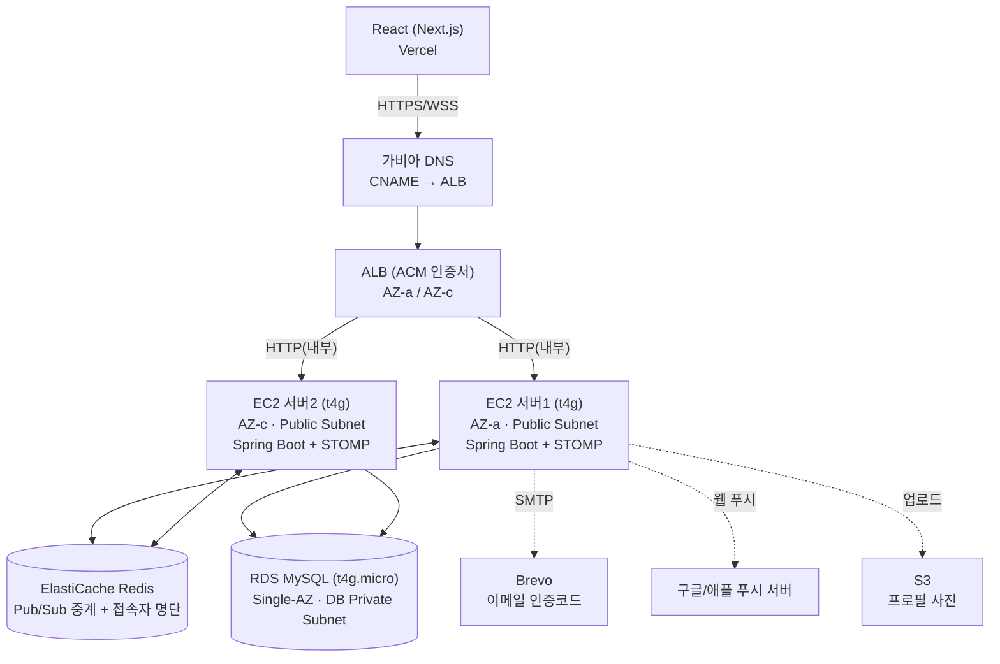

# face 콕 — 인프라 설계 문서

정리 기준일: 2026-08-30 (최종 개정)

## 1. 배경

React(Next.js) + TypeScript + Supabase 구조로 로그인·프로필·콕찔러보기·채팅·미션·신고·관리자 기능을 한 차례 전부 구현했었다. Supabase는 호스팅 편의 때문에 선택한 것일 뿐이었고, 이후 다음 이유로 스택을 전환한다.

- 폴링 기반 실시간 처리의 한계 (지연, 불필요한 요청, 확장성 저하)
- Supabase RLS + anon key 노출 구조에서 발견된 권한 체크 누락 보안 이슈
- 팀 스킬(Spring) 및 AWS 인프라 활용도

**최종적으로 백엔드는 Java Spring Boot, DB는 AWS RDS MySQL, 인프라는 AWS(서울 리전)로 전환한다.**

## 2. 서비스 규모

| 항목 | 기준 |
| --- | --- |
| 일 최대 이용자(DAU) | 1일차 300명 → 2일차 600명 → 3일차 900명 (누적 증가) |
| 최대 동시 WebSocket 연결 | 900 (3일차 기준) |
| 실제 총 가입자 예상 | 약 300명 (재방문 누적으로 일일 활성 수치가 늘어나는 구조) |
| 하루 메시지량 | 기존 15,000건/일(300명 기준) 유지, 부하테스트 상한을 넉넉히 잡아 재확인 |
| 운영 기간 | 3일 (2026.09.30~10.02) |
| 서비스 종료 | 2026.10.03 00:00, 이후 데이터 전부 삭제 |

**3일짜리 일회성 행사 서비스**라는 전제, 그리고 **최대치(900)를 기준으로 설계하되 실제 부하는 더 낮을 수 있다는 점**이 계속 영향을 준다.

## 3. 검토했다가 제외한 안 — API Gateway + Lambda

- Lambda는 요청마다 새로 실행되는 구조라 DB 연결을 매번 새로 맺으려는 경향이 있음
- 대량 동시 접속 시 RDS 동시 연결 수 한계를 넘어 일부 메시지 전송이 실패할 위험
- 완화하려면 RDS Proxy 같은 추가 인프라가 필요해 "단순하고 저렴하게"라는 목표와 어긋남

→ **항상 켜져 있고 DB 연결을 재사용하는 서버(Spring) 기반**으로 설계한다.

## 4. 최종 아키텍처

**핵심 구성**: EC2 2대를 **서로 다른 가용영역(AZ-a / AZ-c)** 에 배치, ALB로 분산. NAT Gateway는 사용하지 않고 EC2를 Public Subnet에 둬서 비용을 아끼되, **인바운드는 ALB 보안그룹에서 오는 요청만 허용**한다. RDS는 DB 전용 Private Subnet에 두고 EC2에서만 접근 가능하게 제한한다.

**인증서**는 ALB에 AWS Certificate Manager(ACM, 무료)를 붙여서 처리한다.

**도메인**은 Route 53이 아니라 **가비아**에서 구매한 도메인을 그대로 쓴다.

## 5. 인프라 역할

| 구성요소 | 역할 |
| --- | --- |
| React (Vercel) | 화면. 사용자가 실제로 만지는 유일한 부분 |
| 가비아 DNS | 도메인 이름 해석을 ALB까지 연결 |
| ALB | 요청을 서버 2대에 분산, 한 대 죽어도 나머지로 처리 + HTTPS 인증서(ACM) 처리 |
| EC2 (Spring Boot, t4g) × 2, 서로 다른 AZ | 로그인·프로필·콕·미션·신고·관리자 REST 처리 + STOMP로 채팅 실시간 처리 + 웹 푸시 발송 |
| Redis (ElastiCache) | ① 서버1·서버2 간 STOMP 메시지 중계(Pub/Sub) ② 지금 누가 접속 중인지 명단 관리(웹 푸시 여부 판단용) |
| RDS (MySQL, Single-AZ) | 회원·프로필·콕·채팅·미션·신고·푸시 구독 정보가 영구히 쌓이는 곳 |
| Secrets Manager | 세션 시크릿·DB 접속정보·VAPID 키(웹 푸시 인증) 보관 |
| Brevo | 회원가입/로그인 인증코드 이메일 발송 |
| S3 | 프로필 사진 저장 |
| 구글/애플 푸시 서버 | 참가자가 앱을 안 보고 있을 때 백그라운드 알림 전달 (아이폰은 홈 화면 추가 필요) |

## 6. 개발 환경 및 배포 전략

**초기 개발은 전부 로컬에서 진행한다.**

- 프론트(React)는 지금부터 계속 **main 브랜치를 Vercel에 배포**하며 진행
- 백엔드(Spring)는 **초기 개발이 끝난 뒤 AWS에 처음 올리고, 그때부터 실제 인프라 테스트·개선 작업을 시작**한다
- 배포는 **Docker 컨테이너**로 감싸서, 로컬·서버가 같은 실행 환경을 보게 한다
- 팀원 로컬 개발 환경 통일을 위해 **Docker Compose**로 MySQL·Redis 등을 동일 버전으로 로컬에 띄운다
- **Flyway**로 DB 스키마 마이그레이션을 버전 관리한다 — 각자 로컬 DB의 실제 데이터는 달라도, **스키마 구조는 항상 일치**하게 유지

**로컬 개발 중 DB는 팀원 각자의 로컬 인스턴스를 쓰고, Railway 같은 공유 원격 DB는 두지 않는다.** 이유:
- 원격 공유 DB는 동시 작업 시 서로 데이터를 건드려 충돌할 위험이 있음
- 로컬 개발 단계에서 굳이 네트워크 의존을 추가할 필요가 없음
- 두 사용자 간 상호작용(매칭·채팅) 테스트는 본인 로컬 DB 안에 테스트 계정 2개를 만들어서 확인 가능
- 진짜 다중 사용자·네트워크 환경 테스트는 백엔드를 AWS에 올리는 시점부터 자연스럽게 시작됨

## 7. 사용자 흐름

### 로그인 / 프로필 / 콕 / 미션 / 신고 / 관리자

1. React → 가비아 DNS → ALB가 서버 하나 골라줌 → EC2(Spring)
2. EC2가 세션 쿠키 확인 후 RDS에서 읽고 씀
3. 로그인 시에는 EC2가 Brevo로 인증코드 이메일 발송 요청

Redis·STOMP는 이 흐름에 전혀 관여하지 않는다.

### 채팅

1. A는 서버1, B는 서버2에 연결될 수 있음 (ALB가 나눠서 배정)
2. A가 메시지 전송 → 서버1이 메시지를 RDS에 저장 + Redis에 "발행(publish)"
3. 서버2가 Redis를 "구독(subscribe)"하고 있다가 그 메시지를 받아서 B에게 전달

### 알림 (웹 푸시) — 참가자 전용, 관리자는 대상 아님

관리자는 부스에서 대시보드를 계속 켜놓고 있다고 가정하여, **관리자 알림(신고 접수 등)은 지금 있는 WebSocket 실시간 반영만으로 처리**하고 별도 백그라운드 푸시는 만들지 않는다. 아래 흐름은 **참가자용(콕 받음/매칭 성사/메시지 도착)** 에만 적용된다.

**전제**: 참가자가 앱을 홈 화면에 추가(PWA 설치)해둔 상태 — 단, **아이폰(iOS Safari)만 필수**이고 안드로이드/PC는 설치 없이 브라우저 알림 권한만으로 동작한다.

1. 콕 받음 / 매칭 성사 / 메시지 도착 이벤트 발생
2. 이벤트를 처리한 서버가 **Redis의 접속자 명단**을 조회해 "대상자가 지금 (서버1이든 서버2든) WebSocket에 연결돼 있나" 확인
   - 연결돼 있으면 → WebSocket으로 바로 전달, 여기서 끝
   - 연결 안 돼 있으면 → 3번으로
3. 서버가 RDS에서 대상자의 푸시 구독 정보 조회
4. Secrets Manager의 VAPID 비밀키로 알림 내용을 암호화해 구글/애플 푸시 서버로 전송
5. 구글/애플 푸시 서버가 사용자 폰까지 전달 → Service Worker가 잠금화면/알림창에 표시

## 8. 메시지 안정성

- 메시지 전송 → DB 저장 → **ACK 반환**. ACK를 받은 메시지만 저장이 보장된 것으로 본다
- ACK 미수신 시 클라이언트가 재전송할 수 있는데, 중복 저장을 막기 위해 `message` 테이블에 **`client_message_id`(UUID, UNIQUE)** 를 추가해 멱등성을 확보한다
- 메시지 순서는 현재 규모에서는 `message_id` 자동 증가 순서로 충분하다고 보고, 별도 `seq` 컬럼 도입은 보류

## 9. 오토스케일링

개발 기간 여유와 포트폴리오 가치를 고려해 **Auto Scaling Group 도입을 시도**한다.

- **최소 2대(AZ 분리 유지) ~ 최대 4대** 범위로 설정 — 최소값을 지금 설계한 안정성 기준선 아래로 내리지 않음
- 새 인스턴스가 자동으로 뜰 때 Spring 앱이 자동 배포되도록 AMI 또는 부팅 스크립트 준비 필요 (이 부분이 가장 시간이 걸리는 작업으로 예상)
- 스케일 아웃 트리거 지표는 CPU만으로는 WebSocket 특성상 부정확할 수 있어, 연결 수 등 커스텀 지표 활용을 검토
- 스케일 인(서버 축소) 시 기존 WebSocket 연결이 끊기는 건 정상 동작 — 클라이언트 자동 재연결 로직으로 대응

## 10. 장애 대응 현황

| 상황 | 대응 |
| --- | --- |
| EC2 한 대 장애 | 나머지 한 대로 재접속 가능 (ALB가 헬스체크로 감지 후 신규 연결만 정상 서버로 라우팅) |
| 기존 연결 중인 사용자 | 순간이동하지 않고 끊김 — 클라이언트 자동 재연결 필요 |
| AZ 한 곳 장애 | 다른 AZ의 EC2가 생존 |
| RDS 장애 | **SPOF (Single-AZ, 프리 티어 한도상 Multi-AZ 불가로 감수)** |
| Redis 단일 노드 장애 | 구성에 따라 SPOF 가능 — HA 수준은 비용·복잡도 보고 별도 결정 |
| 동일 버그가 두 서버 모두에 배포됨 | 두 서버 모두 영향 — 배포 전 검증으로 대응 |

## 11. 부하테스트 계획

| 항목 | 내용 |
| --- | --- |
| 목표 동시 연결 | WebSocket 900개 |
| 메시지 처리량 | 30 → 60 → 100 msg/s 단계적 증가 |
| **지속시간 테스트 (중요)** | t4g 계열은 버스터블(CPU 크레딧) 인스턴스라, **짧은 burst가 아니라 장시간 지속 부하에서 크레딧 소진 여부를 반드시 확인** |
| 확인 항목 | 연결 유지 여부, CPU/Memory, DB INSERT 지연시간, p95/p99, 메시지 유실·중복, 재접속 폭주 대응, 오토스케일링 트리거 동작 |

**RDS는 프리 티어 한도상 t3/t4g micro가 최대**라, 이 테스트에서 지속 부하 시 성능 저하가 확인되면 12번(플랜 B)으로 전환한다.

## 12. 플랜 B — 메시지 큐 + 워커 (조건부)

부하테스트 결과 RDS가 지속 부하를 못 버티면, DB 저장 경로에만 메시지 큐(예: SQS)를 얹어 쓰기 속도를 완만하게 조절한다.

- 실시간 전달(사용자에게 보이는 것)은 그대로 Redis Pub/Sub으로 즉시 처리 — 지연 없음
- DB 저장만 큐에 넣고, 워커가 일정한 속도로 처리해 RDS 순간 부하를 스무딩
- 지금 당장 구축하지 않고, **테스트 결과에 따라 조건부로 도입**

## 13. 비용 구조 (대략치, 최종 확정 전 AWS 요금 계산기로 재확인 필요)

2025.07.15부터 AWS 신규 계정은 서비스별 시간 무료 대신 **최대 $200 크레딧을 지급하는 통합 Free Plan** 방식으로 바뀌었다. EC2는 t3.micro~small, t4g.micro~small 등 여러 사이즈가 "프리 티어 사용 가능"으로 표시되며 모두 크레딧으로 커버된다. ALB도 750시간 + 15 LCU가 무료로 포함된다. RDS는 t3/t4g micro가 프리 티어 한도상 최대이며, **Multi-AZ는 대상이 아니다.**

| 항목 | 비고 |
| --- | --- |
| EC2 × 2 (t4g.micro~small) | 프리 티어 크레딧 적용 대상 |
| ALB | 750시간 + 15 LCU 무료, 이 규모 트래픽이면 대부분 커버될 것으로 예상 |
| Redis (ElastiCache, 노드 1개) | 750시간 무료 한도 안 |
| RDS (t4g.micro, Single-AZ) | 750시간 + 20GB 무료 한도 안 |
| 가비아 DNS | AWS 비용 없음 (도메인 구매 비용은 가비아에 별도 지불) |
| Secrets Manager | 무료 티어 자체가 없는 서비스, 소액 |
| 웹 푸시 발송 | 무료 (브라우저 벤더 제공) |
| S3 | 5GB 무료 한도 안 |
| Brevo | 이 규모(인증메일 수준)면 무료 플랜 범위 안 |

**운영 계획**: 개발·테스트 기간에는 서버를 켜둔 채로 진행하되, **추석 연휴(약 1주)에는 리소스를 중지**해 비용이 나가지 않게 한다.

## 14. 이번 문서 범위 밖 — 후속 문서에서 다룰 것

- 기존 TypeScript 코드에서 발견된 보안 이슈(관리자·프로필 RPC 권한 체크 누락 등)는 별도 버그 수정 작업으로 처리
- **팀원 온보딩 문서** — Docker Compose·Flyway로 로컬 환경 세팅하는 방법
- **API 명세, ERD(MySQL 기준 재정리)** — FE/BE 레포 분리 후 병렬 개발을 위한 계약 문서
- 레포 분리(FE/BE) 및 새 백엔드 레포 기본 구조
- 보안/비밀값 관리 원칙 체크리스트
- 아이폰 PWA 설치 유도 UI/문구
- `push_subscription` 테이블 스키마, VAPID 키 발급·회전 절차
- CI/CD 파이프라인
